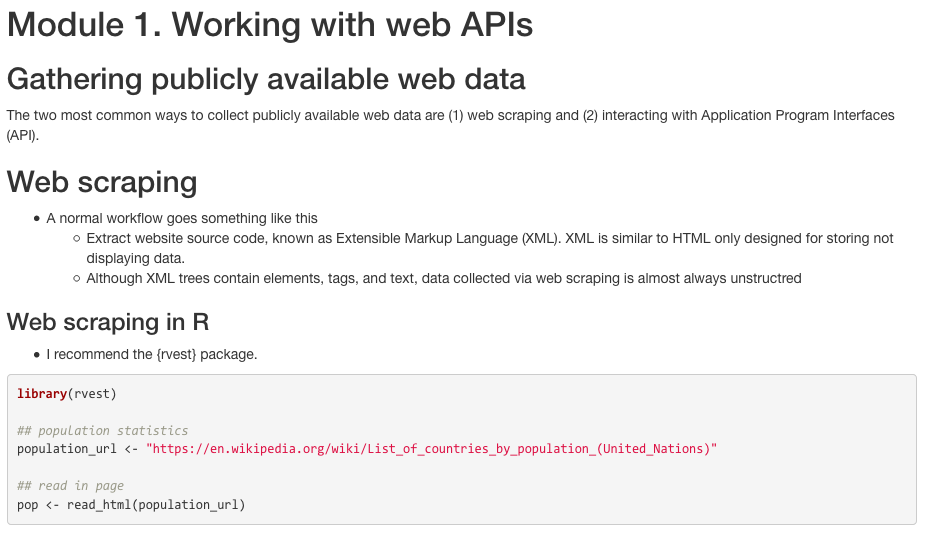
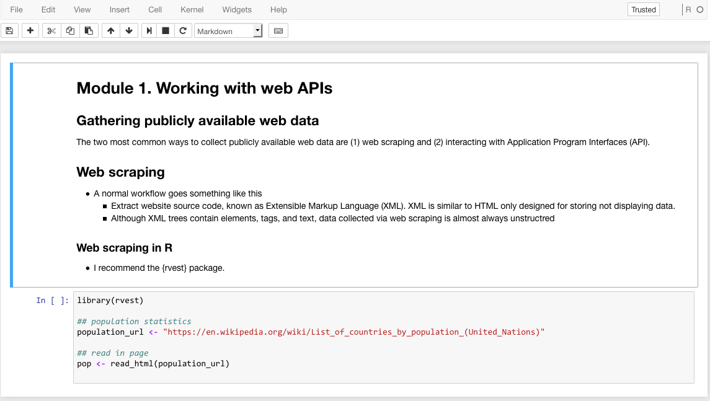

rmd2jupyter
-----------

Convert rmarkdown (.Rmd) files into jupyter notebooks (.ipynb).

### Example

Create a .Rmd file.

``` r
rmd <- "# Module 1. Working with web APIs

## Gathering publicly available web data

The two most common ways to collect publicly available web data are (1) web scraping and (2) interacting with Application Program Interfaces (API).

## Web scraping

- A normal workflow goes something like this
    - Extract website source code, known as Extensible Markup Language (XML). XML is similar to HTML only designed for storing not displaying data.
    - Although XML trees contain elements, tags, and text, data collected via web scraping is almost always unstructred

### Web scraping in R
- I recommend the {rvest} package.

\`\`\`{r}
library(rvest)

## population statistics
population_url <- \"https://en.wikipedia.org/wiki/List_of_countries_by_population_(United_Nations)\"

## read in page
pop <- read_html(population_url)
\`\`\`"

## save as temp file
tmp <- tempfile(fileext = ".Rmd")
cat(rmd, file = tmp)

## render html
rmarkdown::render(tmp)

## output output
browseURL(gsub("\\.Rmd$", ".html", tmp))
```

Screen capture of output.



Now convert to .ipynb.

``` r
## install and load rmd2jupyter
devtools::install_github("mkearney/rmd2jupyter")
library(rmd2jupyter)

## convert
rmd2jupyter(tmp)

## onen via jupyter notebook method
```

Screen capture of jupyter notebook.


